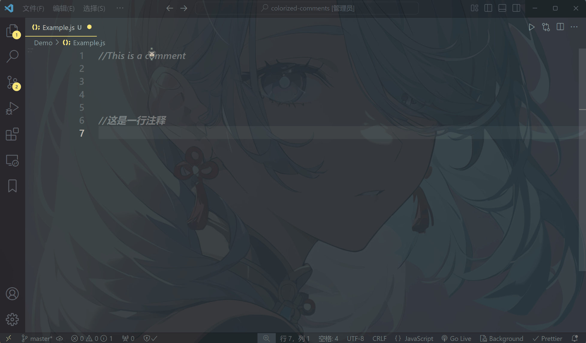

# Colorized Comments

[中文](README_CN.md) | English

A VS Code extension that allows you to customize your code comments with colorful backgrounds and text colors. Make your important comments stand out and improve code readability.

## Features

- 🎨 Preset color schemes for quick styling
- 🔄 Fully customizable background and text colors
- 💾 Auto-save settings across VS Code sessions
- 🌍 Support for 30+ programming languages
- ⚡ Quick access via hover or context menu

## Usage

### Via Mouse Hover

1. Hover over any comment line
2. Wait for 3 seconds (configurable)
3. Choose background/text color
4. Select your preferred color

### Via Context Menu

1. Right-click on a comment line
2. Select "Change Comment Style"
3. Follow the color picker prompts

## Extension Settings

| Setting                        | Description                          | Default |
| ------------------------------ | ------------------------------------ | ------- |
| `colorizedComments.hoverDelay` | Delay before showing color picker    | 3000ms  |

## Supported Languages

- JavaScript/TypeScript
- Python, Java, C/C++
- HTML, CSS, PHP
- And 25+ more languages

## Feedback & Support

- 📧 Email: chenkaixuan23_@tju.edu.cn
- 💻 GitHub: [@tju-tomorrow](https://github.com/tju-tomorrow)

## License

This extension is licensed under the MIT License - see the [LICENSE](LICENSE) file for details
